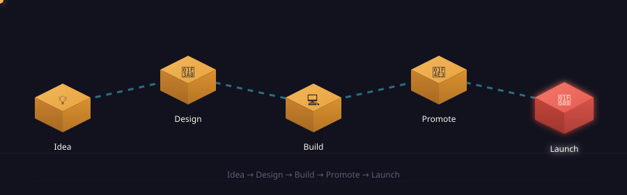

### Graphic & Web Designer · Digital Marketer · DDEO

📍 Gorakhpur, Uttar Pradesh, India&nbsp;&nbsp;·&nbsp;&nbsp;🕵️‍♂️ Learning from others

 

### 🔁 My process, in 3D

Idea → Design → Build → Promote → Launch — isometric blocks, floating and lit with depth, tracing how a project moves through my hands.

  

### 🐍 Contribution snake

<picture>
  <source media="(prefers-color-scheme: dark)" srcset="https://raw.githubusercontent.com/rkbharti806/rkbharti806/output/github-contribution-grid-snake-dark.svg" />
  <source media="(prefers-color-scheme: light)" srcset="https://raw.githubusercontent.com/rkbharti806/rkbharti806/output/github-contribution-grid-snake.svg" />
  
</picture>

> **Needs a one-time setup** — see `.github/workflows/snake.yml` in the files below. Once you add it and run it once from the Actions tab, this snake eats through your real, live contribution graph and refreshes automatically every 6 hours. Until then this shows broken — that's expected before setup.

 

### 🌱 About me

- 👀 Interested in making new friends — but old is gold, as you know
- 🌱 Currently learning **UX/UI & Graphic Design**
- 💞️ Looking to collaborate with new developers and learn cool things
- 📫 Reach me at **rbharti1496@gmail.com**
- 💭 *"I'm just simple & cool ;-). I love Mother Nature and learn something new every day, from others."*

 

### 📌 Pinned projects

| Project | Description | Stack |
|---|---|---|
| 🔗 [**Nwmail**](https://github.com/rkbharti806/Nwmail) | A simple website explaining what email is, email protocols, and how they work | HTML |
| 🔗 [**imgwall**](https://github.com/rkbharti806/imgwall) | A wallpaper website built with plain HTML and CSS flexbox | HTML |
| 🔗 [**Rbshop**](https://github.com/rkbharti806/Rbshop) | A shopping website demo | HTML |
| 🔗 [**JavaScript30**](https://github.com/rkbharti806/JavaScript30) | The 30 Day Vanilla JS Challenge — core JS fundamentals *(fork)* | JavaScript |
| 🔗 [**robofriends**](https://github.com/rkbharti806/robofriends) | React tutorial app from a Udemy course *(fork)* | JavaScript |

 

### 📊 GitHub stats

 

### 🛠️ Tools I use

 

### 🤝 Connect with me

  

